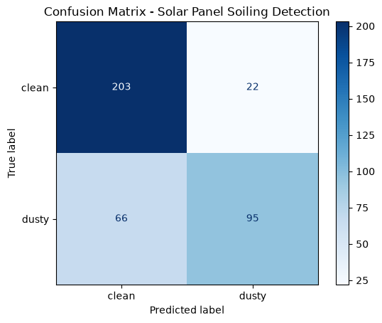
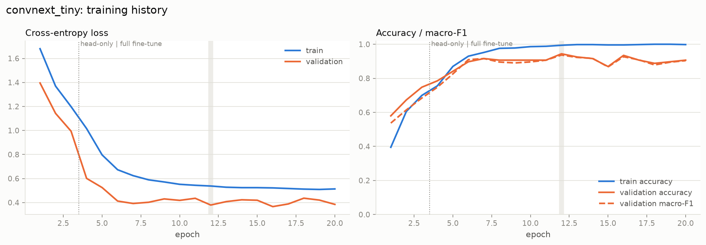

# ☀️ Solar Panel Fault & Soiling Detection

A computer-vision system that inspects a photo of a solar panel, classifies its condition into one
of **six classes**, and turns that into a maintenance decision (severity + recommended action).
Built with PyTorch transfer learning and served through a Streamlit dashboard with Grad-CAM
explanations.

| Class | Severity | What the operator should do |
|---|---|---|
| Clean | none | Nothing |
| Dusty / Soiled | moderate | Schedule a wash (soiling costs 5–25 % output) |
| Bird Droppings | moderate | Spot-clean; local shading creates hot-spots |
| Snow Covered | low | Usually self-clears; clear manually only if prolonged |
| Physical Damage | high | On-site inspection; cracked glass usually means replacement |
| Electrical Damage | critical | Isolate string, dispatch technician; fire risk |

---

## 📊 Results

<!-- RESULTS:START -->
**Selected model: `convnext_tiny`** (highest validation macro-F1 (ties -> fewer parameters)).

| Backbone | Params (M) | Val macro-F1 | Test accuracy | Test macro-F1 | Test ROC-AUC | CPU ms/img | GPU ms/img | Best epoch |
|---|---|---|---|---|---|---|---|---|
| mobilenet_v3_large | 4.21 | 0.882 | 90.6% | 0.911 | 0.988 | 7.3 | 3.4 | 23 |
| efficientnet_v2_s | 20.19 | 0.930 | 88.8% | 0.901 | 0.986 | 28.2 | 9.7 | 15 |
| **convnext_tiny** ✓ | 27.82 | 0.937 | 93.5% | 0.932 | 0.997 | 25.6 | 3.5 | 12 |

Per-class test results for `convnext_tiny` (107 test images, top-2 accuracy 99.1%):

| Class | Precision | Recall | F1 | Test images |
|---|---|---|---|---|
| Bird Droppings | 0.90 | 0.95 | 0.93 | 20 |
| Clean | 0.90 | 1.00 | 0.95 | 27 |
| Dusty / Soiled | 1.00 | 0.81 | 0.89 | 26 |
| Electrical Damage | 1.00 | 1.00 | 1.00 | 12 |
| Physical Damage | 0.78 | 0.88 | 0.82 | 8 |
| Snow Covered | 1.00 | 1.00 | 1.00 | 14 |




For reference, the previous version of this project (binary clean/dusty, Keras MobileNetV2, un-deduplicated data) reached 77.2 % test accuracy with a dusty-class recall of 0.59.
<!-- RESULTS:END -->

All numbers are on a held-out test split (15 %) that was never used for model selection. The
winning backbone is chosen on the *validation* split by macro-F1, so every class counts equally
regardless of how many test images it has.

---

## 🗂️ Dataset

**Source:** Kaggle, [*Solar panel clean and faulty images*](https://www.kaggle.com/datasets/pythonafroz/solar-panel-clean-and-faulty-images)
(six folders of web-scraped photos: `Bird-drop`, `Clean`, `Dusty`, `Electrical-damage`,
`Physical-Damage`, `Snow-Covered`; 885 files). Download it and place it at `Faulty_solar_panel/`
in the project root (the folder is git-ignored).

The raw download is noisy. `scripts/prepare_dataset.py` cleans it before any training happens:

| Stage | Images | Notes |
|---|---|---|
| Collected (recursive, incl. `Bird-drop/New/`) | 885 | `desktop.ini` and other non-images ignored |
| Readable | 885 | none corrupt |
| After exact de-duplication (MD5) | 794 | 91 byte-identical copies |
| After near-duplicate removal (dHash, Hamming ≤ 4) | 713 | 79 re-encoded/resized copies + 2 images filed under two different labels |

Without this step the same photo lands in both train and test, and the metrics lie.

Stratified split, 70 / 15 / 15 per class, seed 42:

| Class | Train | Val | Test |
|---|---|---|---|
| bird_drop | 90 | 19 | 20 |
| clean | 126 | 27 | 27 |
| dusty | 125 | 27 | 26 |
| electrical_damage | 55 | 12 | 12 |
| physical_damage | 34 | 7 | 8 |
| snow_covered | 69 | 15 | 14 |
| **total** | **499** | **107** | **107** |

The repository also contains a pointer to the *Deep Solar Eye* dataset
(`Solar_Panel_Soiling_Image_dataset/`, 45 754 fixed-camera 192×192 frames with a continuous
power-loss label). It is a different domain (one panel, one camera, 15 days) and is **not** used
for training here; it is a natural next step for a soiling-*regression* model.

---

## 🧠 Method

1. **Backbone** – ImageNet-pretrained CNN from `torchvision` with the final layer replaced by a
   6-way head. Three candidates are trained and compared by default:
   `mobilenet_v3_large` (edge-friendly), `efficientnet_v2_s`, `convnext_tiny`.
2. **Two-stage fine-tuning**
   * *Warm-up* – backbone frozen (BatchNorm statistics fixed), train only the new head.
   * *Fine-tune* – everything trainable with discriminative learning rates (backbone 1e-4, head
     1e-3), 1-epoch linear warm-up then cosine decay, AdamW, label smoothing 0.1,
     class-weighted cross-entropy for the imbalance, bf16 autocast, gradient clipping,
     early stopping on validation macro-F1.
3. **Augmentation** – random-resized-crop, flips, small rotations, mild colour jitter, random
   erasing. Evaluation uses a plain squash-resize so panel edges are never cropped away.
4. **Selection** – best validation macro-F1 wins (ties → fewer parameters). Test metrics
   (accuracy, macro-F1, ROC-AUC, per-class P/R/F1, confusion matrix) are computed once afterwards.
5. **Inference** – horizontal-flip test-time augmentation, low-confidence and close-call
   flagging for manual review, and Grad-CAM heat-maps so a user can see *where* the model looked.

---

## 📂 Project structure

```text
.
├── app.py                     # Streamlit dashboard (inspect / performance / dataset / about)
├── main.py                    # Train + compare backbones, export outputs/final_model.pt
├── requirements.txt
├── src/
│   ├── config.py              # Paths, class names & metadata, hyper-parameters
│   ├── data.py                # ImageFolder datasets, augmentation, DataLoaders, class weights
│   ├── model.py               # torchvision backbone factory, head swap, freeze helpers
│   ├── train.py               # Two-stage fine-tuning loop with early stopping
│   ├── evaluate.py            # Metrics, confusion matrix & training-curve plots
│   ├── gradcam.py             # Grad-CAM implementation
│   └── inference.py           # Predictor: load checkpoint, predict, summarise, explain
├── scripts/
│   ├── prepare_dataset.py     # Verify → de-duplicate → stratified split → JSON report
│   └── predict.py             # CLI prediction (text or JSON, optional Grad-CAM export)
├── Faulty_solar_panel/        # Raw Kaggle download (git-ignored)
├── data/                      # Generated train/val/test (git-ignored)
└── outputs/
    ├── final_model.pt         # Self-describing checkpoint used by the app (git-ignored)
    ├── metrics.json           # Test metrics of the selected model
    ├── comparison.json / .md  # Backbone leaderboard
    ├── dataset_report.json    # What prepare_dataset.py removed and why
    ├── confusion_matrix.png, training_curves.png
    └── runs/<backbone>/       # Per-backbone metrics, history and plots
```

---

## 🚀 Quick start

```bash
# 1. Environment (Python 3.10+). Install torch/torchvision for your CUDA version first:
#    https://pytorch.org/get-started/locally/
python -m venv venv && source venv/bin/activate      # Windows: .\venv\Scripts\Activate.ps1
pip install -r requirements.txt

# 2. Data: put the Kaggle folder at ./Faulty_solar_panel, then clean + split it
python scripts/prepare_dataset.py --raw_dir Faulty_solar_panel --out_dir data

# 3. Train (all three backbones, ~5 min on a 6 GB laptop GPU) ...
python main.py
#    ... or a single one
python main.py --backbones efficientnet_v2_s --epochs 30

# 4. Dashboard
streamlit run app.py

# 5. Command line
python scripts/predict.py path/to/panel.jpg --cam outputs/cams
```

`main.py` options: `--backbones`, `--epochs`, `--warmup_epochs`, `--patience`, `--img_size`,
`--batch_size`, `--num_workers`, `--seed`, `--data_dir`, `--out_dir`.

### Running from a fresh clone

The repository holds code and results only. Two things are git-ignored and must be obtained
separately:

| You want to… | You need | Where it goes |
|---|---|---|
| Run the dashboard / CLI without training | `final_model.pt` (~107 MB, ask the author or train it) | `outputs/final_model.pt` |
| Retrain or reproduce the numbers | the Kaggle dataset above (~310 MB, or a zip of it from the author) | `Faulty_solar_panel/` |

`data/` is regenerated by `prepare_dataset.py` (seed 42, so the split is identical). It is only
needed for training and for the dashboard's *"Try one sample per class"* button; everything else
in the app works without it. The Deep Solar Eye folder is not required for anything.

---

## 🖥️ Dashboard

* **Inspect panels** – drop one or many photos. Each gets a label, severity badge, confidence,
  recommended action, full probability bar chart and a Grad-CAM overlay. Batches get a
  severity-sorted summary table with CSV export. A button loads one random test image per class
  for a quick demo. Sidebar toggles: TTA, Grad-CAM, confidence threshold, close-call margin.
* **Model performance** – test metrics, per-class precision/recall/F1, confusion matrix,
  training curves, backbone leaderboard.
* **Dataset** – the de-duplication funnel, per-class split counts, one example per class, and
  the list of label-conflict images that were dropped.

---

## ⚠️ Limitations & next steps

* ~700 unique images; `physical_damage` has 34 training examples. More data for the rare
  classes is the single biggest lever left.
* Web-scraped photos vary in camera, angle and lighting; performance on a fixed inspection rig
  will differ. Fine-tune on a few hundred in-domain images before deployment.
* One label per image. For per-cell localisation, use the Grad-CAM map or move to detection /
  segmentation.
* Deep Solar Eye could be used to add a soiling-*level* regression head.
* k-fold cross-validation would give tighter confidence intervals on the small test set.
